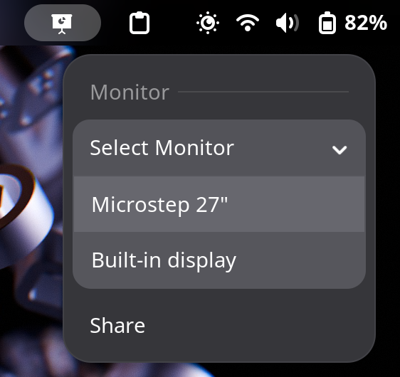

# Beamshare GNOME extension

Extension for the [beamshare](https://github.com/RobbeDGreef/beamshare) utility which allows you to share only a single window to an external monitor.

## Install

First `beamshare` needs to be installed and in your path, head to [the beamshare github page](https://github.com/RobbeDGreef/beamshare) and follow the installation steps. 

Next you must clone this repo into `~/.local/share/gnome-shell/extensions/`.

Now simply enable the extension, (you may have to log in and out), and you are good to go.